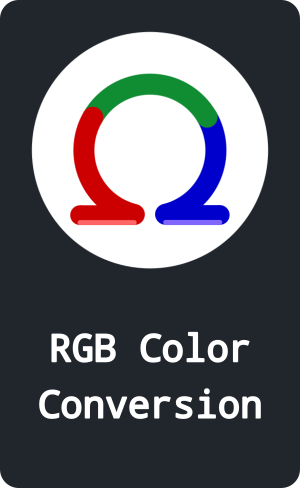

 

[][RGB]    
[][ICO]    
[][HSL]    
[][GRAPH]

 

<!----------------------------------------------------------------------------->

[GRAPH]: https://github.com/OmegaTools/GRAPH
[ICO]: https://github.com/OmegaTools/ICO
[RGB]: https://github.com/OmegaTools/RGB
[HSL]: https://github.com/OmegaTools/HSL
